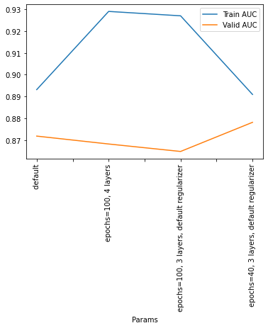

### LOG: 20210126 - (RESEARCH) WNV prediction NN 1DCNN (NN v4)
https://www.kaggle.com/jhinchoh/wnv-prediction-nn-v4


```python
import pandas as pd
import matplotlib.pyplot as plt

df = pd.read_csv('../../../data_other/kaggle_data/predict_west_nile_virus/result_log_20210126.csv',header=None,delimiter=':')
df.reset_index(inplace=True)
df.columns = ['group','name','value']
df['group'] = df['group'] // 3

df = df.pivot(index='group', columns='name', values='value') \
       .reset_index().rename_axis(None, axis=1).drop('group',axis=1).set_index('Params')

display(df)
df.columns = ['Train AUC','Valid AUC']
df = df.astype('float')
df.plot()
plt.xticks(rotation=90)
plt.show()
```


<div>
<style scoped>
    .dataframe tbody tr th:only-of-type {
        vertical-align: middle;
    }

    .dataframe tbody tr th {
        vertical-align: top;
    }

    .dataframe thead th {
        text-align: right;
    }
</style>
<table border="1" class="dataframe">
  <thead>
    <tr style="text-align: right;">
      <th></th>
      <th>Train AUC</th>
      <th>Valid AUC</th>
    </tr>
    <tr>
      <th>Params</th>
      <th></th>
      <th></th>
    </tr>
  </thead>
  <tbody>
    <tr>
      <th>default</th>
      <td>0.8931556344032288</td>
      <td>0.8718733787536621</td>
    </tr>
    <tr>
      <th>epochs=100, 4 layers</th>
      <td>0.9289525747299194</td>
      <td>0.8682563304901123</td>
    </tr>
    <tr>
      <th>epochs=100, 3 layers, default regularizer</th>
      <td>0.9269419312477112</td>
      <td>0.8648427724838257</td>
    </tr>
    <tr>
      <th>epochs=40, 3 layers, default regularizer</th>
      <td>0.8909445405006409</td>
      <td>0.8781768083572388</td>
    </tr>
  </tbody>
</table>
</div>


    

    


```python

```
