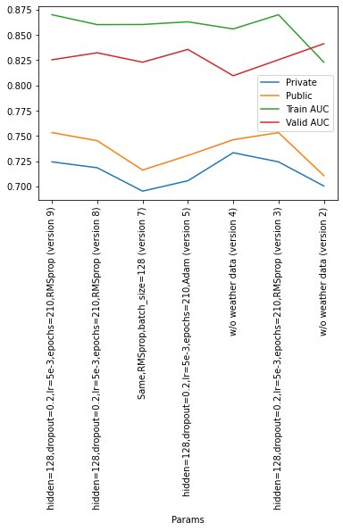

### LOG: 20210131 - (RESEARCH) WNV competition NN
https://www.kaggle.com/jhinchoh/wnv-competition-nn-v1


```python
import pandas as pd
import matplotlib.pyplot as plt

df = pd.read_csv('../../../data_other/kaggle_data/complete_west_nile_virus/result_log_20210131.csv',header=None,delimiter=':')
df.reset_index(inplace=True)
df.columns = ['group','name','value']
df['group'] = df['group'] // 5

df = df.pivot(index='group', columns='name', values='value') \
       .reset_index().rename_axis(None, axis=1).drop('group',axis=1).set_index('Params')

display(df)
df.columns = ['Private','Public','Train AUC','Valid AUC']
df = df.astype('float')
df.plot()
plt.xticks(rotation=90)
plt.show()
```


<div>
<style scoped>
    .dataframe tbody tr th:only-of-type {
        vertical-align: middle;
    }

    .dataframe tbody tr th {
        vertical-align: top;
    }

    .dataframe thead th {
        text-align: right;
    }
</style>
<table border="1" class="dataframe">
  <thead>
    <tr style="text-align: right;">
      <th></th>
      <th>Private</th>
      <th>Public</th>
      <th>Train AUC</th>
      <th>Valid AUC</th>
    </tr>
    <tr>
      <th>Params</th>
      <th></th>
      <th></th>
      <th></th>
      <th></th>
    </tr>
  </thead>
  <tbody>
    <tr>
      <th>hidden=128,dropout=0.2,lr=5e-3,epochs=210,RMSprop (version 9)</th>
      <td>0.72424</td>
      <td>0.75323</td>
      <td>0.870032548904419</td>
      <td>0.8254050016403198</td>
    </tr>
    <tr>
      <th>hidden=128,dropout=0.2,lr=5e-3,epochs=210,RMSprop (version 8)</th>
      <td>0.71838</td>
      <td>0.74518</td>
      <td>0.8602160215377808</td>
      <td>0.8323099613189697</td>
    </tr>
    <tr>
      <th>Same,RMSprop,batch_size=128 (version 7)</th>
      <td>0.69524</td>
      <td>0.71615</td>
      <td>0.8603433966636658</td>
      <td>0.82297682762146</td>
    </tr>
    <tr>
      <th>hidden=128,dropout=0.2,lr=5e-3,epochs=210,Adam (version 5)</th>
      <td>0.70552</td>
      <td>0.73053</td>
      <td>0.8629903793334961</td>
      <td>0.835641622543335</td>
    </tr>
    <tr>
      <th>w/o weather data (version 4)</th>
      <td>0.73330</td>
      <td>0.74616</td>
      <td>0.8559377193450928</td>
      <td>0.8095902800559998</td>
    </tr>
    <tr>
      <th>hidden=128,dropout=0.2,lr=5e-3,epochs=210,RMSprop (version 3)</th>
      <td>0.72424</td>
      <td>0.75323</td>
      <td>0.870032548904419</td>
      <td>0.8254050016403198</td>
    </tr>
    <tr>
      <th>w/o weather data (version 2)</th>
      <td>0.70034</td>
      <td>0.71069</td>
      <td>0.8230322003364563</td>
      <td>0.8412995338439941</td>
    </tr>
  </tbody>
</table>
</div>


    

    

